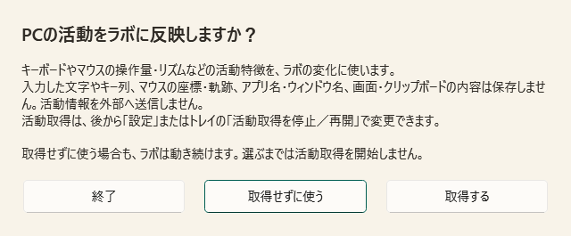
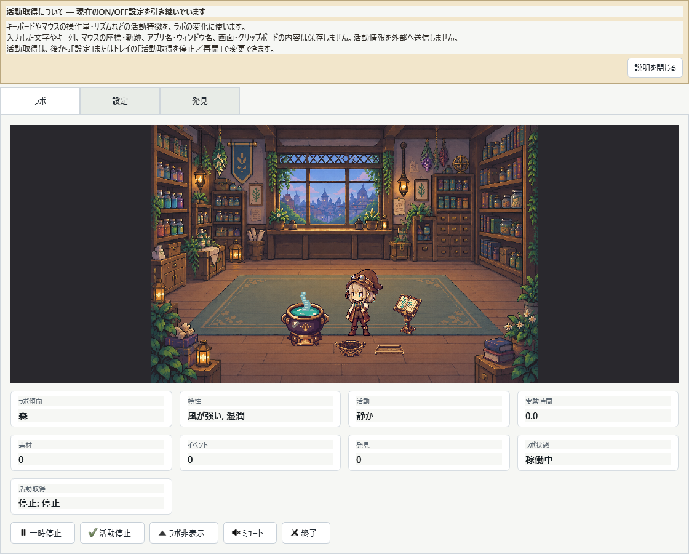

# v0.9.7 活動取得の説明と設定の引き継ぎ

新規GUI起動では「取得する」「取得せずに使う」「終了」を選べる。選択前は実活動の取得元を起動しない。「取得せずに使う」でもラボは動き、設定またはトレイから後で取得を再開できる。閉じるボタンやEscapeは終了として扱い、保存先も作らない。

既存ユーザーは現在の活動取得ON/OFFを維持する。ラボ上部に説明を表示し、読んだら「説明を閉じる」を押せる。この操作はON/OFFを変更しない。クリック透過を利用している場合は、トレイの「活動取得の説明を閉じる」からも閉じられる。閉じた後は次回起動で繰り返さない。

画像はテスト用データからアプリ自身のQtウィジェットを描画したもので、OS画面や他のアプリを撮影したものではない。Windowsの日本語フォントで文字とボタンが欠けないことを確認する。

## 保存と実行モード

- 設定・発見を引き継ぎ、説明状態だけをSettingsトップレベルへ追加する。schema_versionは1を維持する。旧ONを同意履歴として記録しない。
- 明示 `--activity-provider demo` / `none` は実活動の選択を省略する。新規demo実行で保存しても未説明のままとし、後の通常GUI起動で選択できる。
- `--ephemeral` は既存設定を読まず、選択・説明状態も保存しない。`--data-root` を併記しても同じ。明示診断ログは出力できる。
- `--no-ui` は従来の非対話CLIで、GUIの選択画面は表示しない。
- 古い版へ戻すと説明状態が保存時に落ち、更新し直した際に説明が再表示されることがある。活動ON/OFFは旧版でも読める。

## 検査範囲

全135テストが合格。新規3選択、Escape/閉じる、既存ON/OFF、既読、拒否後の再開、設定の往復、demo/noneからの移行、通常/一時GUIの実起動経路を検査した。取得元生成数を計測し、選択前・拒否・旧OFFでゼロ、再開後に一度だけ生成されることを確認した。既存113テストも含む。

検査はすべて `MINIATURED_WORLD_DATA_DIR` を専用先へ上書きし、ユーザーの通常データを読み書きしない。配布検査はwheelのコード/素材とソース、exeの184素材を比較し、WindowsネイティブGUIの旧ON/OFF・一時実行・CLIを確認する。公開後に添付exe/SHA256と説明画像を再取得し、同じ起動検査を行う。実測と公開結果の正本はv0.9.6 Act loop 002、詳細ログは `logs/activity-notice-v0.9.7`。

配布前の検査ではwheelの226コード/素材ファイルとソース、exeの184素材のバイト一致を確認した。Windows実行では旧ONが15.278秒/15フレーム、旧OFFが0.473秒/10フレームで正常終了し、ON/OFF・他の設定・既存発見を保持した。旧OFFでは取得元は未生成のまま。一時GUIは15.270秒/15フレーム、既存の壊れた4テストJSONも内容・更新時刻を保持した。通常の既定/明示保存先、CLI5フレームも合格。

exe: 52,549,324 bytes、SHA256 `d5b0fc2885c26133b9987a5e7170f8690558294accb9836079855cb17a47e511`。

原画・184素材・アニメーションは変更なし。素材セットはv0.9.5、アプリはv0.9.7。V1全体の合格や8時間運転の再検証を意味しない。[設計判断](adr/0009-activity-notice.md)。
