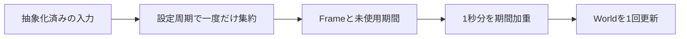

# ADR 0017: 非重複の活動窓と固定World時計

2026-09-15 / 採用: v0.9.15

旧実装では集約間隔が未適用で、窓内に残したイベントを何度も反映していた。同じ10秒の無入力でも100ms更新ではWorld時間80.99、1000ms更新では8.09となり、Worldが呼出し回数に依存していた。

Activityは設定された100〜5000msの窓で発行する。取り出したイベントを破棄し、未来分だけを残す。境界上で後から届いた別イベントは消費可能とし、タイムスタンプだけで新しいイベントを重複扱いしない。各特徴は1000ms相当のレートへ正規化する。Idleは活動のリズム特徴に混ぜない。

Worldは1000ms固定刻みで更新し、全機構の呼出し回数を安定させる。集約したFrameと期間をFIFOへ入れ、World更新で1000ms分だけ期間加重して取り出す。不足はquietで埋める。長い窓は複数回へ分配されるが、その期間を超えて再使用しない。未反映期間は固定設定の継続実行で窓長+1000ms未満に収まる。

画面は最新の集約結果を表示し、Worldは期間分だけ消費する。session_durationは仮想セッションの経過時間とし、入力の初回時刻へ依存させない。反映量は表示とWorldの両方に適用する。

種類・窓の変更と休止境界で集約途中/未反映期間を破棄する。Worldの時計と端数時間は保持し、休止中は進めない。Demoはpoll回数によらない1000ms刻みの時刻列とし、Runtimeのreset_timingで復帰境界より古い周期を捏造しない。Deferredはこの境界も生成前に保持する。

GUI/CLIのheartbeatは要求tickと集約間隔の小さい方。CLIの--frames×--tick-interval-msによる時間予算は維持し、必要なら内部を細分化する。安定性ログは各tickの実際の間隔を記録する。GUIの終了はフレーム数でなく経過予定時間によって判定し、途中の周期変更へ対応する。

全World機構の可変dt化、単なるタイマー短縮、窓の無期限再利用、過去のWorldの巻戻しは不採用。長窓の反映は閉じるまで待ち、さらに数回に分配されるため遅れが増える。旧版の境界二重計上とsession_duration依存の修正により、旧版との乱数トレースは完全一致を保証しない。同じ版・設定・seed・時刻付き入力ではheartbeat粒度によらず一致させる。
