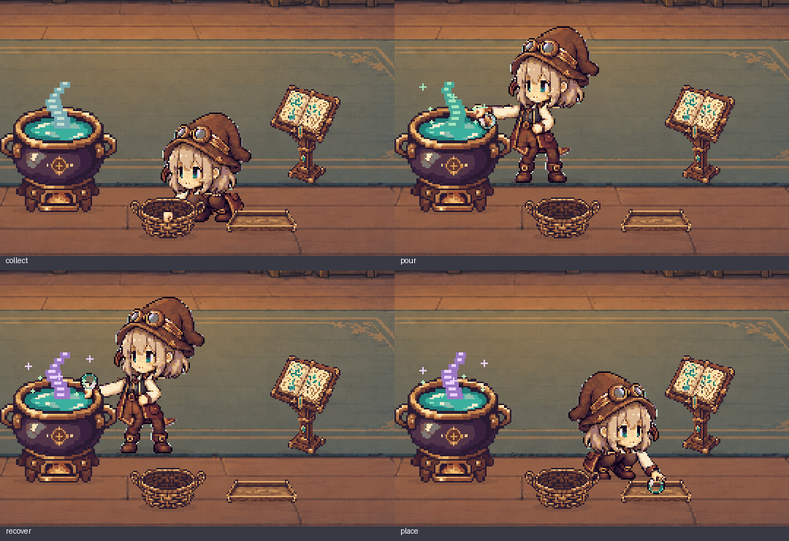

# v0.9.5 手元の連続動作の検証

本を確認し、屈んで素材を取り、釜へ注いで完成品を回収し、トレーへ置く4系列を実装した。瓶を手の把持点へ接続し、接触したコマで受け渡す。

[全体・通常速度](images/lab-preview.gif) / [全体・0.5倍速](images/hand-workflow-slow.gif)

| 手元の拡大 | 通常速度 | 0.5倍速 | 表示枠 / 時間 |
| --- | --- | --- | --- |
| 本をめくる | [GIF](images/hand-read-close.gif) | [GIF](images/hand-read-close-slow.gif) | 13 / 1.8秒 |
| 素材を取る | [GIF](images/hand-collect-close.gif) | [GIF](images/hand-collect-close-slow.gif) | 16 / 2.2秒 |
| 注いで回収する | [GIF](images/hand-mix-close.gif) | [GIF](images/hand-mix-close-slow.gif) | 16 / 3.2秒 |
| トレーへ置く | [GIF](images/hand-place-close.gif) | [GIF](images/hand-place-close-slow.gif) | 16 / 2.2秒 |

## 原画・接触

全身原画44種類を61の表示枠へ展開。人物128×128、共通64色、二値alpha、4pxの透明余白を維持し、顔・帽子を共通化した。屈みは膝・腰を曲げた原画で表し、手マスクは全身と同じ画素を使う。運搬歩行8枚と空/内容入り瓶2枚を追加。新素材132枚、既存48枚で合計180 PNG。

隣接コマの手首・把持点の最大移動は読書7.811、取得8、調合8、配置8論理px。固定区間の靴の接地は1px以内。把持位置、紙面・かごとの接触、釜口内の回収、トレー上面の底面一致を検査した。指・瓶・家具の前縁を部分合成し、実背景上の全コマと通常/低速GIFで確認した。

一つの瓶に素材1〜6種類をまとめ、空瓶で完成品を回収する。表示上の所有者はかご→手→釜、完成品は釜→手→トレーと移る。同じ物理瓶は各コマで一か所だけに存在する。トレーは最新の完成品を一つ表示する枠で、Worldの在庫は変更しない。

## 検証結果

- pytest: **106 passed**。既存のWorld再現性・入力・プライバシー検査を含む。
- 素材1〜6種類、受け渡し直前/当該/直後、全コマの停止・非表示、Qt他タブ、重複通知、セッション初期化を検査。30ms・75ms・まとめ進行で同じ結果になる。
- 実際のQt描画で全61コマの2×2ピクセル単位、640×427・900×620・1280×720の表示と接触を検査。合成したデモ状態だけを描画し、デスクトップや他アプリは撮影しない。
- 原画から180 PNGと2 JSONの**182ファイルを完全再現**。背景2ファイルはv0.9.4と同一。
- wheel/exe内の**184素材すべてがソースとバイト一致**。展開wheelから61作業コマをQt描画。
- ソースGUI: 15.409秒、15フレーム、正常終了。
- exe: CLI 5フレーム、Windows実活動GUI 30.364秒・30フレーム、正常終了。PySide6 6.9.3 / Python 3.13.7 / PyInstaller 6.22.0。

公開exeのSHA256: `b53f25975efc36846da6adeec4dcc80ddec14d718ea12366bbcf89c8612c04ee`（52,543,234 bytes）。公開後の全添付物再取得・一致、CLI 5フレーム、GUI 15秒以上の結果はOODA Act正本へ記録する。

## 再現と範囲

[素材仕様の再現コマンド](lab-asset-spec.md#再現)、[原画と正確な生成プロンプト](../art/hand-motion-v0.9.5/README.md)、[設計判断](adr/0007-contact-synchronized-hand-motion.md)、[AC1〜9](plans/v0.9.5-hand-motion.md)を参照。ローカル詳細証拠は `logs/hand-motion-v0.9.5`、OODA正本はv0.9.4のAct loop 002。

一巡は16,217ms。計画の14〜16秒は目安とし、接触と80px/秒の歩行を優先した。自由散策、全リアクションの連続原画化、高DPI/複数モニターの全環境保証、新たな8時間検証は含めない。手元4系列の合格をV1全体の合格とはしない。
