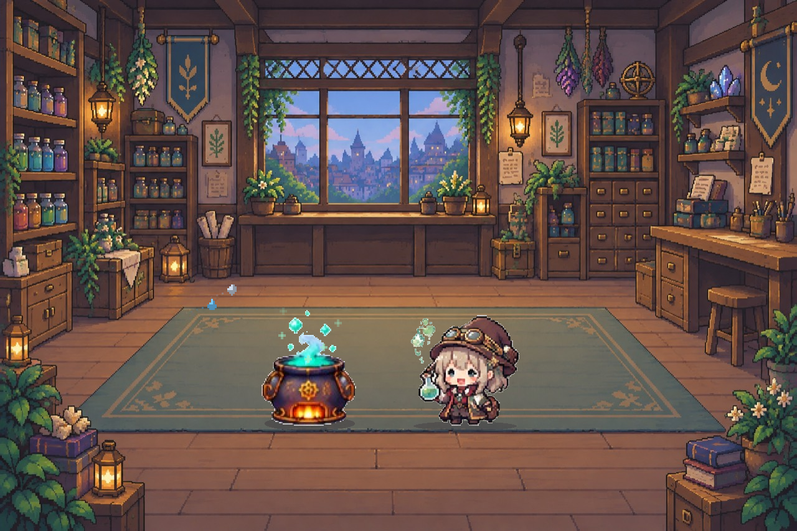

# ラボ素材・アニメーション制作仕様

v0.9.1では、ユーザー提供の背景・錬金術師シート・赤線付き魔法釜シートを基準にする。背景を描き直さず、キャラクターと釜を独立した透過レイヤーとして描画する。

## 共通配置

- 基準舞台は1280×853。全レイヤーに同一の倍率を適用する。
- 表示領域へ全景が入るよう縦横比を保持し、余白は中央寄せする。背景だけをトリミングしない。
- 釜の描画領域は `(400, 444, 192, 256)`、キャラクターは `(632, 468, 230, 230)`。座標は左上x/y、幅、高さ。
- 両者の接地点は基準舞台のy=684付近。絨毯の手前側で同じ床面に立つ。
- 背景、釜と接地影、素材エフェクト、キャラクターと接地影の順に描画する。
- ピクセル素材の補間ぼかしは使用しない。将来の差し替えも接地点と透明余白を維持する。

## キャラクター

配置先: `src/miniatured_world/assets/characters/alchemist_girl/`

| ファイル | 状態 | 動き |
| --- | --- | --- |
| idle.png | 素材待ち | 最大2pxのゆっくりした上下動 |
| work.png | 実験 | 調合ポーズ、最大2pxの上下動 |
| success.png | 新規発見・イベント | 3.2秒のリアクション、最大6pxの小さな跳躍 |
| failure.png | 強すぎる反応 | 元シートの失敗ポーズ |
| rest.png | 静かな活動・停止 | 元シートの睡眠ポーズ |

全ファイルは192×192 RGBA PNG。絵の下端はy=179、接地基準はy=180。帽子・手・足・付属の記号を含め、四辺に4px以上の透明余白を置く。成功の左右と帽子を切らず、失敗を別の驚きポーズへ置き換えない。

元資料に「64×64」とあるが、提供されたJPEGは1280×853の説明用シートであり、厳密な64pxスプライトではない。無理に64pxへ縮小せず、切り出し実寸を共通キャンバスに配置している。5ポーズは各1枚で、歩行などの連続描き起こしは本版に含まない。

## 魔法釜

配置先: `src/miniatured_world/assets/cauldron/magic_cauldron/`

| ファイル系列 | 元シートの行 | 用途 |
| --- | --- | --- |
| idle_01～08.png | 待機・弱い湯気 | 待機・休憩 |
| receive_01～08.png | ぐつぐつ・通常の沸騰 | 素材を実験中 |
| failure_01～08.png | 強く沸騰 | 強い反応 |
| success_01～08.png | 発光・魔法的な反応 | 新規発見 |

各96×128 RGBA PNG、全32枚。8fps、1秒で8コマをループ。台座の下端をy=119、接地基準をy=120へ揃える。蒸気の高さに合わせて各コマを拡大縮小しない。右側の単発イベント例を4状態の代用として使わない。

## 素材エフェクト

素材が供給される活動中のみ、最大6種の小さなピクセル形状が左側から釜へ移動する。種は葉状、水は雫、鉱物は結晶、他素材は粒として色で区別する。1.8秒周期の弧を描き、釜の口の約 `(496, 577)` へ入る際に消える。

反応光は最大5個の小さな十字粒子、煙は最大3組の淡いピクセル片。釜の口の周囲に限定し、人物を覆う大きな円は描かない。元アトラスの右側アイテム・エフェクト見本は現行アニメーションへ直接取り込まず、素材形状をQtで描画している。

## 時間と停止

描画は単調増加時計と専用Qtタイマーを使用し、更新上限は設定FPSと30Hzの小さい方。釜のコマ番号は経過時間から求めるため、活動集約間隔が1000msでも毎秒8コマで動く。

一時停止、ラボ非表示、他タブ、ウィンドウ非表示、終了時は描画タイマーを止める。再表示時に時計の基準を再設定し、非表示時間による大きな飛びを避ける。新規の発見・イベントだけが成功を発生させ、起動時の保存済み発見や同じ状態の再通知は成功を繰り返さない。

描画からActivity Providerやシミュレーションを進めない。保持するのは既存のサニタイズ済みスナップショットと表示時間のみ。

## 再現と検査

元シートからの切り出し:

```powershell
.venv\Scripts\python.exe scripts/prepare_lab_sprites.py --characters <キャラクターシート.jpg> --cauldron <赤線付き釜シート.jpg>
```

背景に接続した明るい画素のみを除去し、顔や服の白を保持する。赤線とラベルは切り取り範囲から除外する。座標、キャンバス、元画像SHA256は `assets/sprites_manifest.json` に記録する。元シートはユーザー提供資料として別保管し、個人の添付ファイルパスを成果物に埋め込まない。

表示確認:

```powershell
.venv\Scripts\python.exe -m pytest
.venv\Scripts\python.exe scripts/render_lab_preview.py
```

Pillowがある環境では `--gif docs/images/lab-preview.gif` を付けると8秒・64コマのGIFも生成できる。PNGは出力ディレクトリの `work.png` を使用する。GIFは共通パレットで背景のちらつきと容量を抑える。

レンダラーはデモ状態のアプリ自身だけを描画する。デスクトップ、他アプリ、実入力内容は撮影・記録しない。5状態、全32コマ、640×427・1280×720・900×620の構図、実タイマーの動き、停止再開、透過余白、台座基準を確認する。



## 既知の制限

原資料は生成された説明用JPEGのため、コマ間には手描き風の形状差や圧縮由来の縁が残る。新しい8時間連続検証、高DPI/マルチモニター実機保証、歩行・全身の連続アニメーションは本版の保証範囲外。
