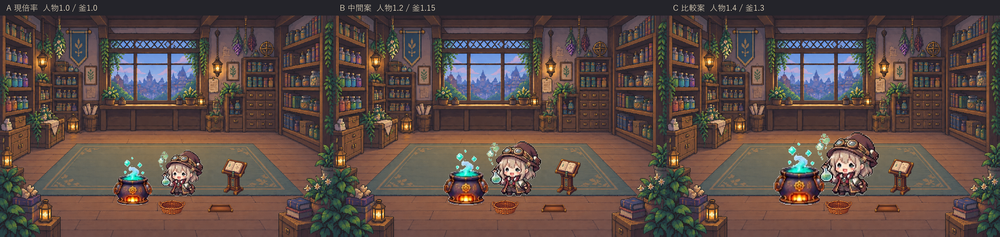
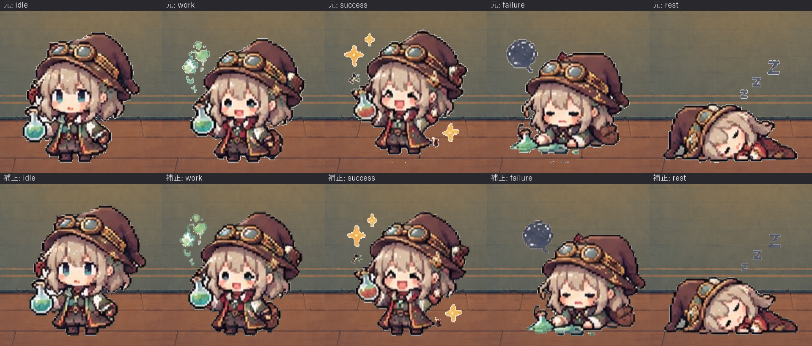

# ラボ作業場所の改善と検証（v0.9.2）

v0.9.1を基準に、背景→小道具込みの静止比較→サイズ確定→作業連携の順で改善した。

## 工程と静止比較

右奥の机・椅子を、浅い壁面本棚へ置換した。中央の窓、灯り、絨毯と床余白を残し、書見台・素材かご・完成品トレーは透過素材として独立させた。

比較は同じ小道具配置に対して、A:人物1.0/釜1.0、B:人物1.2/釜1.15、C:人物1.4/釜1.3を行った。人物の表情と作業場所が読み取りやすいCを採用。ただし倍率だけでは釜の口が手より高くなるため、釜の接地を30px手前へ移した。本は高さ140pxとし、動作プレビューで帽子と干渉したためx=900へ調整した。倍率はこの比較後に確定している。



## 配置

共通舞台は1280×853。位置は道具の接地点、作業位置は人物の接地点。アプリ入力の座標ではない。

| 道具 | 接地点 | 描画サイズ | 人物の作業位置 |
| --- | --- | --- | --- |
| 釜 | (510,730) | 249.6×332.8（透明余白含む） | (672,684) |
| 本/書見台 | (900,692) | 98×140 | (724,696) |
| 素材かご | (660,766) | 104×54 | (750,726) |
| 完成品トレー | (847,758) | 96×30 | (744,706) |

人物の待機接地は(694,696)、透明キャンバスの描画サイズは322×322。各道具は配置・状態・作業位置を持つ。描画は接地点yで奥から並べ、かごの前縁を内容物の手前へ重ねる。影は30/255の薄い色とし、跳躍時も接地側に残す。

## 作業連携

素材到着1.5秒→本の確認/ページめくり2.2秒→素材取り出し1.6秒→調合3.2秒→完成品配置1.8秒→待機位置へ復帰0.7秒。1巡11秒。

サニタイズ済みスナップショットの素材増分で開始する。起動時の在庫、減少、同じ通知では開始しない。実行中の追加到着は最大1巡にまとめ、素材種類も6種までに制限する。一時停止・非表示時は時計を止め、セッション変更で表示状態を初期化する。

本・かご・完成品は表示演出であり、Worldの素材消費、発見、レシピ結果や永続化を変更しない。完成品はそのセッションの表示用小瓶である。人物は既存5ポーズの切替と近接作業点への補間で動く。歩行の描き起こしは含まない。

## 確認結果

- `.venv/Scripts/python.exe -m pytest`: 63 passed（素材補正器の合成画素テストと各素材の移動時刻の検査を含む）。
- 作業順序、状態の重複通知、継続到着、停止/非表示/再開、セッション初期化、位置の連続性、プライバシー、World不変を確認。
- 640×427、1280×720、900×620で全作業段階を実Qt描画するテストに合格。
- 補正後の全5ポーズ・釜32コマで、4px以上の透明余白、共通接地、状態ごと8コマの差分、帽子・手足・成功左右の保持を確認。背景上の全37枚を目視した。
- 新背景、静止構図、各作業段階を目視。本と帽子の重なりを配置修正。

## 素材品質

外周3,196画素を限定補正し、顔・服・瓶・釜上部の保護対象51,168画素は移動後も元と完全一致する。接地を誤判定させた微小ノイズ17画素を除去した。人物は共通接地と身体中心を合わせ、釜の本体は状態内で完全一致させた。蒸気・粒子・口と火の動きは保持している。



画像生成による人物補正は透過条件を満たさず不採用。ユーザー回答後、Pythonによる輪郭限定補正へ切り替えた。背景・小道具の生成条件は[画像生成記録](lab-image-generation.md)、補正の入力/出力SHA256と移動量は同梱の `sprites_manifest.json` に記録している。

## 配布検証

最終wheelとWindows単体exeの43素材はすべてソースとバイト一致。展開したwheelの0.9.2 importとQt描画、ソースのWindows実GUI15秒、exeのCLI5フレームとWindows実活動GUI30秒が正常終了した。公開後にexeを再取得してSHA256一致と起動を確認し、OODA Act記録に公開結果を残す。新しい8時間連続運転やV1全体の合格判定は今回の範囲に含めない。

## 再現

```powershell
.venv/Scripts/python.exe scripts/compare_lab_layouts.py
.venv/Scripts/python.exe scripts/render_lab_workflow.py
.venv/Scripts/python.exe -m pytest
```

GIF生成は開発環境のPillowを使用する。アプリの実行時依存には追加しない。レンダラーはデモ状態のアプリだけを描画し、デスクトップや他アプリを撮影しない。

素材作業用依存は `pip install -e ".[art]"` で導入できる。

輪郭補正の再現にはv0.9.1タグのassetsを別ディレクトリへ取り出し、`scripts/refine_lab_sprites.py --input <元assets> --output <別出力先>` を使う。補正済みPNGへ重ねて適用しない。
