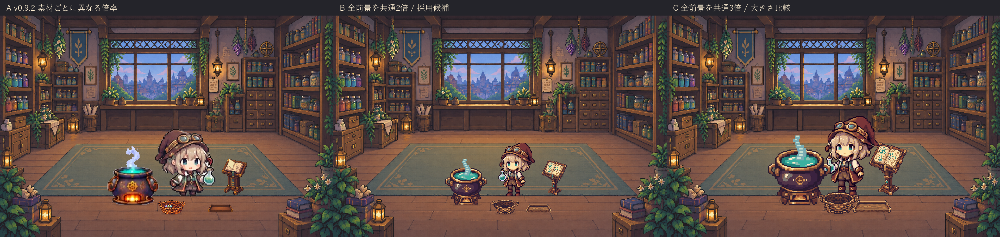
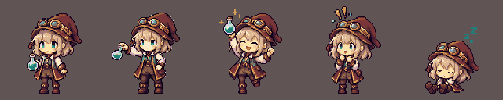

# v0.9.3 前景ドット絵の統一と検証

小道具の高解像縮小と人物/釜の拡大が混在していたため、少女・釜・本・かご・トレーを再制作した。共通パレットと論理ピクセル面へ統一し、素材ごとの解像感の差を解消する。

## サイズ比較

Aはv0.9.2、Bは全前景を共通2倍、Cは共通3倍。Bを採用した。Cは釜・少女・本が密集し、かごと足元が重なる。Bは少女の表情、本の図柄、かごの縁を保ちながら床の余白を確保できる。

## 品質

少女5ポーズ、釜32コマ、小道具3点の40枚を同じ64色パレット・二値alphaへ整形。人物のポーズは同じ縮尺で切り出し、作業姿勢を別途生成して釜側へ手を伸ばした。作業原画の外側に接続した市松背景を除去し、顔・服・瓶の内部明部を残した。全身・帽子・手足・成功の両端と接地を確認する。

釜本体は全32枚で共通、湯気・粒子の色と位置が8コマで変化する。本と帽子の干渉を抑え、完成品トレーを本の左へ寄せて経路を確保した。

## 検証

- pytest: 65 passed。既存の作業連携・停止/非表示/重複・World不変・プライバシーを含む。
- 全40枚の寸法、同一64色パレット、alpha0/255、manifest SHA256を検査。
- 全作業段階の前景が2×2ピクセル単位を保ち、半縮小→最近傍2倍で完全一致することを検査。
- 人物/釜の透明余白・接地、釜各8コマの差分、640×427・1280×720・900×620のQt描画を検査。
- 原画から40素材とmanifestの完全再現を確認。
- wheel/exeの43素材がすべてソースとバイト一致。展開wheel 0.9.3のQt描画、ソースGUI15秒、exe CLI5フレーム/Windows実活動GUI30秒が正常終了（30.246秒、30フレーム）。
- 公開物再取得と起動結果はOODA Act記録へ保存する。

新たな8時間運転やV1全体の合格を示すものではない。
