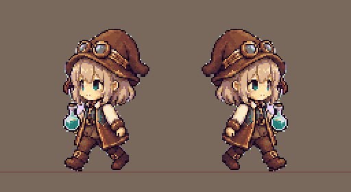
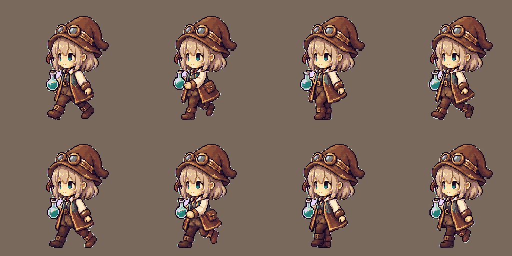

# v0.9.4 歩行モーションの検証

少女が本・素材かご・釜・トレー・待機位置へ歩くようにした。移動中は進む方向を向き、到着すると従来の作業ポーズへ戻る。



## 表示と素材

歩行8枚を128×128、接地y=120、既存64色、二値alphaへ統一。顔と帽子を共通にして、生成差による輪郭のちらつきを抑えた。帽子・手・瓶・靴を透明余白内へ収め、床背景上で確認した。脚と腕の原画を残し、後半の脚の明暗を交替して前後を区別する。



## 動作

速度は舞台上80px/秒、歩行一巡は48px。近い本へは約0.38秒、釜へは約0.88秒で到着する。到着後にページめくり、取り出し、調合、完成品配置を開始する。一時停止・非表示では位置とコマを保持し、同じ状態から再開する。

## 検証

- pytest: 74 passed。既存のプライバシー/World不変を含む。
- 5経路の速度・向き・到着・操作開始、8コマの循環、タイマー刻みの違い、途中停止/非表示/重複通知/セッション初期化。
- 全48素材の寸法、64色、alpha、SHA256。人物・釜の余白と接地、歩行8枚の差分。
- 640×427・1280×720・900×620で左右の全歩行コマと全作業段階をQt描画。
- 全体GIFは実際のQt描画を50ms刻みで合成。実デスクトップや他アプリを撮影しない。

48枚とmanifestの完全再現、wheel/exeの全51素材のバイト一致、展開wheelの歩行Qt描画を確認。ソースGUI15.32秒、exeのCLI5フレーム・Windows実活動GUI30.416秒が正常終了した。公開物再取得と起動の結果はOODA Act記録へ保存する。

## 再現

```powershell
.venv/Scripts/python.exe scripts/build_pixel_assets.py --output logs/walking-v0.9.4/repro
.venv/Scripts/python.exe scripts/build_walk_sprites.py --output logs/walking-v0.9.4/repro
.venv/Scripts/python.exe scripts/render_walk_preview.py
.venv/Scripts/python.exe scripts/render_lab_workflow.py
.venv/Scripts/python.exe -m pytest
```

[原画とプロンプト](../art/walking-v0.9.4/README.md) / [距離同期の設計](adr/0006-distance-synchronized-walking.md)。自由散策、手元の連続原画、V1全体の合否判定は別の判断とする。
